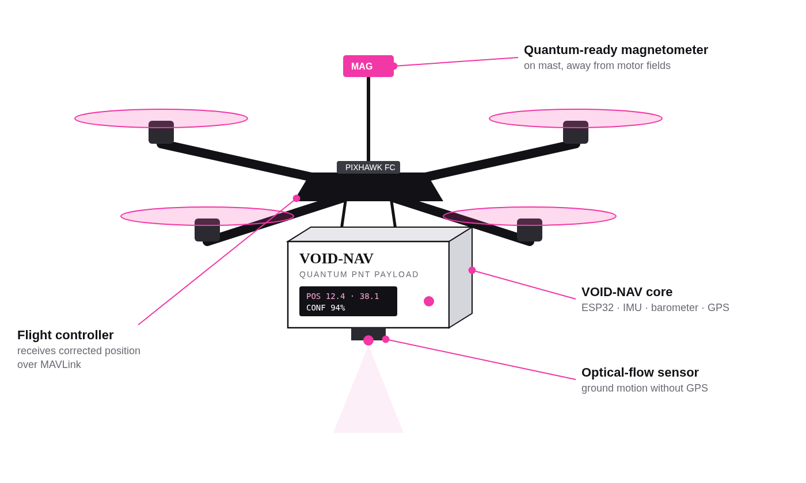
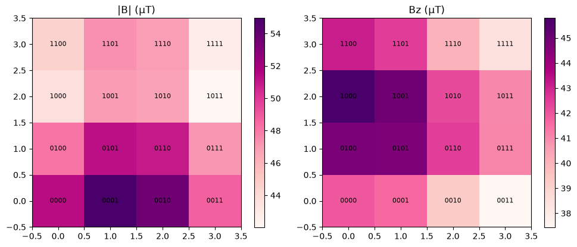
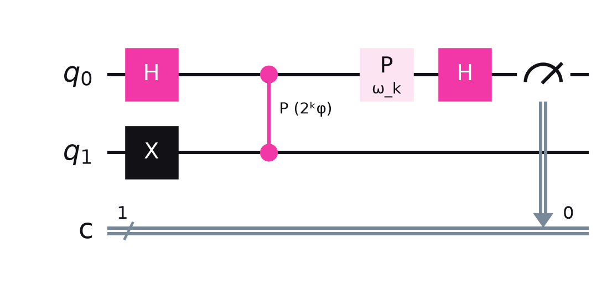
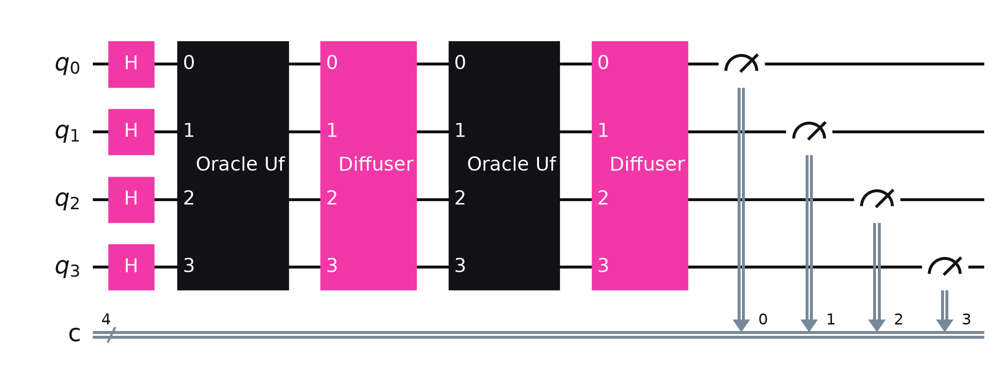
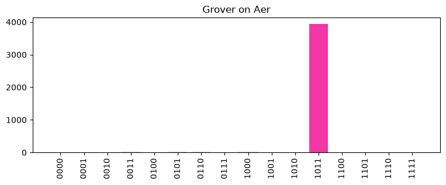
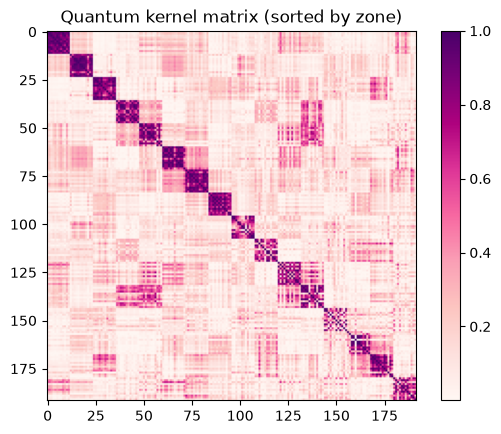
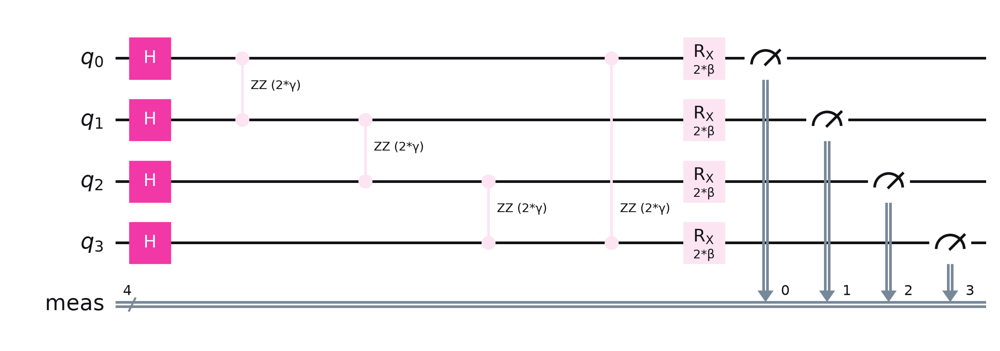
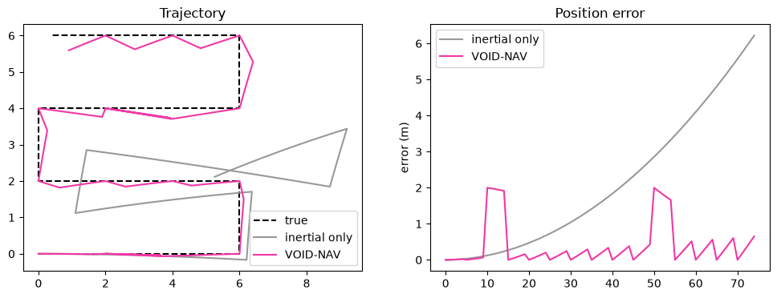

<div align="center">



# VOID-NAV

### Quantum-assisted navigation for drones when GPS goes dark

*When the satellites go silent, the ground still knows where you are.*

[](https://www.ibm.com/quantum/qiskit)
[](https://github.com/Qiskit/qiskit-aer)
[](#-the-problem)
[](notebook/VOID-NAV_Quantum_Simulation.ipynb)

[**▶ Watch the pitch**](https://youtu.be/BV2KYV-yhL0) · [**📓 Open the notebook**](notebook/VOID-NAV_Quantum_Simulation.ipynb) · [**📄 Abstract**](abstract/VOID-NAV_QuantumXpo_Abstract.pdf) · [**🖥 Slides**](deck/VOID-NAV_QiskitFallFest.pdf)

**Team VOID** · Plus Qiskit Fall Fest 2026 · QuantumXpo 2026

</div>

---

## ⚡ TL;DR

A drone loses GPS. Its inertial sensors start to drift. **VOID-NAV** is a small, passive payload that reads the Earth's **magnetic fingerprint**, matches it against a pre-built magnetic map using **four quantum algorithms built in Qiskit**, and snaps the drone back on track.

| | |
|---|---|
| 🛰️ **No satellites** | Works when GNSS is jammed, spoofed, blocked or absent |
| 🤫 **Fully passive** | Emits nothing, so there's nothing to detect |
| ⚛️ **Quantum pipeline** | Sensing → Search → Learning → Planning |
| 🔌 **Retrofit** | Talks MAVLink to any ArduPilot / PX4 drone |
| 💸 **Cheap** | Prototype hardware under ₹4,000 |

---

## 🎯 The problem

GPS signals reach the ground at around **10⁻¹⁶ W**, weaker than background noise. Tunnels, terrain, foliage and interference knock them out. The fallback is the IMU, and IMU error grows with **t²**, so a low-cost unit drifts hundreds of metres within minutes. Navigation-grade INS and cold-atom sensors fix this, but they cost lakhs to crores and never make it onto small tactical drones.

> **VOID-NAV's goal:** give a defence UAV a position it can trust within metres when GNSS disappears, using a passive, low-cost payload that's ready to take a real quantum magnetometer.

---

## 🧭 How it works

```mermaid
flowchart LR
    subgraph SENSE["📡 Sense · 50 Hz"]
        M[Magnetometer<br/>quantum-ready]
        IMU[IMU]
        OF[Optical flow]
        BARO[Barometer]
    end
    subgraph PRE["🧹 Pre-process"]
        CAL[Calibrate]
        FP["Fingerprint<br/>[Bx, By, Bz, |B|, ∇B]"]
        DR[Dead reckoning]
    end
    subgraph Q["⚛️ Quantum engine · Qiskit"]
        Q1[Q1 · Ramsey + IPE<br/>read the field]
        Q2[Q2 · Grover<br/>candidate cells]
        Q3[Q3 · QSVM<br/>zone label]
        Q4[Q4 · QAOA<br/>next waypoints]
    end
    PF{{"🎯 Particle filter<br/>accept only if<br/>Grover ∧ QSVM agree"}}
    AP[🛩️ Autopilot<br/>MAVLink]
    SENSE --> PRE --> Q --> PF --> AP
```



1. **Map:** survey the area once with GPS on and store a 5-D magnetic fingerprint per 2 m cell.
2. **Sense:** GPS off. The payload keeps reading the field and tracking motion.
3. **Match:** once a second, the quantum engine finds where on the map the reading fits.
4. **Correct:** the particle filter resets IMU drift and hands a clean position to the autopilot.

<div align="center">
<br/>
<sub>The 4×4 magnetic map used in the simulation. Each 4-bit label is a Grover search state.</sub>
</div>

---

## ⚛️ The quantum stack

Four circuits, four jobs. Every one of them is in the [notebook](notebook/VOID-NAV_Quantum_Simulation.ipynb) and runs on **Qiskit Aer**.

### Q1 · Quantum sensing: Ramsey interferometry + iterative phase estimation


An NV-diamond sensor *is* a qubit. A Hadamard puts it in superposition, the field **B** imprints a phase **φ = 2πγBτ** (γ ≈ 28 GHz/T), and **iterative phase estimation** reads that phase out one bit at a time through phase kickback.

**Result:** the field phase was recovered exactly in **16 / 16** map cells (6-bit precision).

<br clear="right"/>

### Q2 · Grover's search: finding the matching cell


16 map cells live in **4 qubits**. The **oracle U_f** phase-flips every cell whose fingerprint matches the reading; the **diffuser 2|s⟩⟨s| − I** amplifies them. That takes about √N queries instead of N.

**Result:** **96.1 %** of 4,096 shots landed on the correct cell `1011`.

<br clear="right"/>

<div align="center"></div>

### Q3 · Quantum-kernel SVM: which zone am I in?


Each fingerprint is encoded into a quantum state with a **ZZ feature map**. The kernel **K(x, x′) = |⟨φ(x)|φ(x′)⟩|²** feeds a classical SVM that labels the zone (*corridor / stairwell / lab*). This breaks ties when Grover finds two look-alike cells.

**Result:** **99.0 %** test accuracy, matching a classical RBF-SVM baseline.

<br clear="right"/>

### Q4 · QAOA: magnetically aware route planning


Some regions are magnetically "flat" and others are rich. A QUBO rewards waypoints with strong gradients and penalises adjacent picks. It becomes a **cost Hamiltonian H_C**, with mixer **H_M = ΣXᵢ**, and **p = 1**.

**Result:** QAOA's best sampled bitstring **matches the brute-force optimum**.

<br clear="right"/>

---

## 📊 Does it actually work?

The notebook closes the loop. A simulated drone flies 75 steps across the map with a biased IMU. Every 5 steps VOID-NAV runs **Grover + QSVM** and corrects the position only when they agree.

<div align="center"></div>

| Block | What it computes | Verified result |
|---|---|---|
| Ramsey + IPE | field phase from an NV qubit | **16/16** cells exact |
| Grover (4 qubits) | matching map cell | **96.1 %** on correct cell |
| QSVM (ZZ kernel) | zone label | **99.0 %** accuracy |
| QAOA (p = 1) | best waypoint pair | **= brute-force optimum** |
| Navigation loop | drift with vs without quantum | mean error **2.10 m → 0.40 m (5.3×)** |

> 🔬 **Being honest:** these results come from simulation on a synthetic map. At 16 cells Grover shows the √N idea but doesn't beat a classical lookup. The advantage matters for much larger maps on future hardware. The NV sensor is simulated; the hardware payload uses a MEMS magnetometer today.

---

## 🛠️ Hardware

| Part | Role | Source | ₹ |
|---|---|---|---:|
| QMC5883L magnetometer | main field sensor, on a mast | buy | 300 |
| MPU-9250 IMU | accel + gyro | borrow | 600 |
| BMP280 | altitude | borrow | 150 |
| NEO-6M GPS | mapping + ground truth only | borrow | 450 |
| PMW3901 optical flow | ground motion without GPS | buy (optional) | 2,000 |
| ESP32 DevKit | sensor hub | borrow | 450 |
| Quadcopter frame | the platform | borrow | 0 |
| **Total if bought** | | | **≈ 3,950** |

---

## 🚀 Run it yourself

```bash
git clone https://github.com/Lakshya0104/Quantique.git
cd Quantique
pip install qiskit qiskit-aer scikit-learn matplotlib numpy jupyter
jupyter notebook notebook/VOID-NAV_Quantum_Simulation.ipynb
```

Run every cell. It takes about a minute on a laptop. To regenerate the notebook itself: `python notebook/make_nb.py`.

---

## 📁 Repository map

```
Quantique/
├── notebook/   ⚛️  Qiskit simulation: IPE, Grover, QSVM, QAOA, navigation loop
├── abstract/   📄  QuantumXpo abstract poster (PDF + PPTX)
├── deck/       🖥  Plus Qiskit Fall Fest slides (PDF + PPTX) + circuit art
├── video/      🎬  Round 1 pitch video, scripts, animation code
└── docs/img/   🖼  Figures used in this README
```

---

## 🗺️ Roadmap

- [x] Quantum pipeline simulated and verified on Qiskit Aer
- [x] Pitch deck, abstract and video
- [ ] Run Grover + IPE on **IBM Quantum hardware** via `qiskit-ibm-runtime`
- [ ] Replace the synthetic map with a **real magnetometer survey**
- [ ] Mount the payload on a drone and test in **ArduPilot SITL**
- [ ] Swap in a real **NV-diamond quantum magnetometer**
- [ ] Field trials with defence partners

---

## 🧰 Built with

[Qiskit](https://www.ibm.com/quantum/qiskit) · [Qiskit Aer](https://github.com/Qiskit/qiskit-aer) · [scikit-learn](https://scikit-learn.org) · NumPy · Matplotlib · ArduPilot SITL · ESP32 / Arduino

Algorithm references adapted from [qiskit-community-tutorials](https://github.com/qiskit-community/qiskit-community-tutorials/tree/master/algorithms) and ported to Qiskit 2.x.

---

<div align="center">

### Team VOID

*Built for Plus Qiskit Fall Fest 2026 & QuantumXpo 2026 · RGUKT Nuzvid*

**[▶ youtu.be/BV2KYV-yhL0](https://youtu.be/BV2KYV-yhL0)**

</div>
